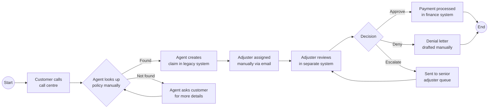

# Business Analysis

## When to use
Use this skill when translating business needs into structured, actionable specifications — from initial stakeholder interviews through process modeling, requirements documentation, and user story creation ready for sprint planning.

## Business Analysis Workflow

```
1. Stakeholder Mapping → 2. Current State (AS-IS) → 3. Gap Analysis → 4. Future State (TO-BE)
         ↓                                                                        ↓
   5. Requirements Elicitation  ←──────────────────────────────────────────────────┘
         ↓
   6. User Stories & Acceptance Criteria
         ↓
   7. Prioritization (MoSCoW / WSJF)
```

## 1. Stakeholder Map

Identify and classify all stakeholders before elicitation:

```markdown
| Stakeholder | Role | Interest Level | Influence | Engagement Strategy |
|-------------|------|---------------|-----------|-------------------|
| Head of Claims | Business Owner | High | High | Co-design workshops |
| Claims Adjusters | End Users | High | Medium | User interviews, UAT |
| IT Security | Governance | Medium | High | Architecture review |
| Compliance | Governance | Medium | High | Requirements sign-off |
| Finance | Reporting Consumer | Low | Medium | Monthly status update |
| Brokers | External Users | High | Low | Surveys, beta program |
```

### RACI Matrix

```markdown
| Activity | Claims Head | IT Lead | Security | Compliance | Dev Team |
|----------|:-----------:|:-------:|:--------:|:----------:|:--------:|
| Requirements sign-off | A | R | C | C | I |
| Architecture decision | C | A | R | C | R |
| UAT execution | A | I | I | C | R |
| Go-live approval | A | R | R | R | I |

R = Responsible, A = Accountable, C = Consulted, I = Informed
```

## 2. Process Modeling (AS-IS)

Model current processes using Mermaid BPMN-style notation:



### Process Pain Points

Document pain points systematically:

```markdown
| # | Pain Point | Impact | Frequency | Affected Roles |
|---|-----------|--------|-----------|----------------|
| 1 | Manual policy lookup takes 3-5 min per call | High handle time, poor CX | Every call (~2,000/day) | Call centre agents |
| 2 | No system integration between claims and finance | Double entry, reconciliation errors | Every approved claim | Adjusters, Finance |
| 3 | Email-based adjuster assignment | Claims sit unassigned for hours | 40% of new claims | Adjusters |
| 4 | Manual denial letters | Inconsistent language, compliance risk | ~200/day | Adjusters, Compliance |
```

## 3. Gap Analysis

Map current capabilities against target state:

```markdown
| Capability | AS-IS | TO-BE | Gap | Priority |
|-----------|-------|-------|-----|----------|
| Policy lookup | Manual search in legacy UI (3-5 min) | API-based instant lookup via policy number or customer ID (< 1s) | Build policy search API, integrate with telephony | Must Have |
| Claim creation | Manual entry in legacy forms | Auto-populated from call transcript + policy data | NLP extraction + API integration | Must Have |
| Adjuster assignment | Manual email-based | Rule-based auto-assignment by skill, capacity, and claim type | Assignment engine + workload balancing | Should Have |
| Denial letters | Manual drafting | Template-based generation with compliance-approved language | Template engine + approval workflow | Should Have |
| Fraud detection | None (reactive only) | ML-based scoring at FNOL | ML model + scoring API | Could Have |
```

## 4. Requirements Specification

### Functional Requirements Template

```markdown
**FR-001: Automated Policy Lookup**

**Description**: The system shall retrieve policy details by policy number, customer name, or phone number within 1 second.

**Business Rule**: If multiple policies match, display all and let the agent select. Expired policies should be shown but flagged.

**Acceptance Criteria**:
- GIVEN a valid policy number WHEN the agent searches THEN the system returns policy details within 1 second
- GIVEN a customer name matching 3+ policies WHEN the agent searches THEN all matching policies are displayed sorted by expiry date
- GIVEN an expired policy number WHEN the agent searches THEN the policy is returned with an "EXPIRED" badge

**Dependencies**: Policy Admin API (FR-010)
**Priority**: Must Have
**Source**: Stakeholder interview with Claims Head (2026-03-15)
```

### Non-Functional Requirements

```markdown
| ID | Requirement | Target | Validation Method |
|----|------------|--------|------------------|
| NFR-001 | System available during business hours (06:00–22:00 CET) | 99.95% | Uptime monitoring |
| NFR-002 | Policy search response time | P95 < 1s | Performance test |
| NFR-003 | Support 500 concurrent agents | Sustained load | Load test (k6) |
| NFR-004 | Audit trail for all claim decisions | 100% coverage | Log review |
| NFR-005 | GDPR-compliant data handling | Full compliance | Privacy impact assessment |
```

## 5. User Stories

### Story Template

```markdown
**US-042: Auto-populate claim from call transcript**

As a **call centre agent**
I want the **claim form to be auto-populated from the call transcript**
So that **I can reduce handle time and data entry errors**

**Acceptance Criteria**:
- [ ] System extracts policy number, loss date, loss type, and description from transcript
- [ ] Extracted fields are pre-filled in the claim form with confidence scores
- [ ] Agent can edit any pre-filled field before submission
- [ ] Fields with confidence < 80% are highlighted for manual review
- [ ] System logs extraction accuracy for model improvement

**Story Points**: 8
**Dependencies**: US-038 (Speech-to-text integration)
**Risks**: Extraction accuracy may vary by accent/language — need fallback to manual entry
```

### Story Splitting Checklist

If a story is too large (> 13 points), split using these strategies:

1. **By workflow step**: separate extraction, validation, and submission
2. **By data type**: handle structured fields first, free-text later
3. **By user role**: agent-facing vs. adjuster-facing
4. **By happy path / edge case**: core flow first, error handling next
5. **By integration**: mock the API first, integrate later

## 6. Prioritization

### MoSCoW

| Priority | Definition | Example |
|----------|-----------|---------|
| **Must Have** | System is unusable without this | Policy lookup, claim creation |
| **Should Have** | Important but has a workaround | Auto-assignment, templates |
| **Could Have** | Desirable if time permits | Fraud scoring, sentiment analysis |
| **Won't Have** | Out of scope for this release | Full self-service portal |

### WSJF (Weighted Shortest Job First)

```
WSJF = (Business Value + Time Criticality + Risk Reduction) / Job Size

| Feature | Biz Value (1-10) | Time Crit (1-10) | Risk Red (1-10) | Size (1-10) | WSJF |
|---------|:-:|:-:|:-:|:-:|:-:|
| Policy lookup API | 9 | 8 | 5 | 3 | 7.3 |
| Auto-populate claim | 8 | 6 | 4 | 5 | 3.6 |
| Fraud scoring | 7 | 3 | 9 | 8 | 2.4 |
```

## Gotchas

- Never write requirements in isolation — validate every requirement with at least two stakeholders from different roles.
- Acceptance criteria must be testable. "The system should be fast" is not testable. "P95 response time < 1s" is.
- Process diagrams should show the actual process, not the idealized one. Interview end users, not just managers.
- Watch for "solution masquerading as requirement" — "Use Kafka for messaging" is a solution. "Events must be processed within 5 minutes" is a requirement.
- For insurance: every requirement touching customer data needs a privacy impact assessment reference.
- Regulatory requirements are non-negotiable Must Haves — never deprioritize them regardless of WSJF score.