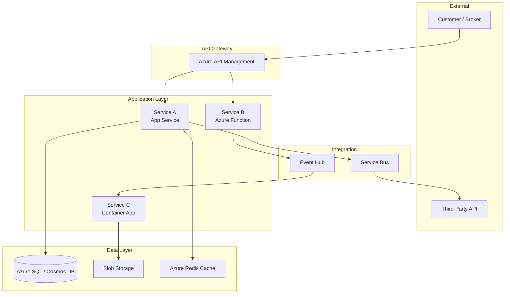

# Solution Architecture

## When to use
Use this skill when designing a new system or capability end-to-end — from stakeholder requirements through component design, integration patterns, and deployment topology. Suitable for both greenfield builds and modernization of existing systems.

## Architecture Document Structure

Every architecture document should contain these sections in order:

### 1. Context & Goals

| Field | Description |
|-------|-------------|
| **Business driver** | Why this system exists — the business outcome it enables |
| **Scope** | What is IN scope and explicitly OUT of scope |
| **Key stakeholders** | Who owns, builds, operates, and consumes the system |
| **Success metrics** | Measurable outcomes (latency targets, throughput, adoption rates) |

### 2. Architecture Principles

Apply these Zurich enterprise architecture principles by default:

- **API-first**: All capabilities exposed as versioned APIs before building UIs
- **Cloud-native on Azure**: Default to Azure PaaS services (App Service, Functions, Cosmos DB, Event Hub)
- **Zero-trust security**: mTLS between services, OAuth 2.0 for user access, no implicit trust between zones
- **Data residency**: EU data stays in EU regions (Switzerland North, West Europe). APAC and Americas have their own landing zones
- **Build vs. buy**: Prefer SaaS/PaaS over custom-built when the capability is not a differentiator

### 3. Component Diagram

Use Mermaid C4 notation:



### 4. Integration Patterns

| Pattern | When to Use | Zurich Standard |
|---------|------------|-----------------|
| **Synchronous REST** | Low-latency request/response, < 5s | Azure API Management + App Service |
| **Async messaging** | Decoupled event processing, eventual consistency OK | Azure Event Hub (high throughput) or Service Bus (ordered/transactional) |
| **File-based batch** | Legacy system integration, nightly feeds | Blob Storage + Azure Data Factory |
| **GraphQL** | Mobile/BFF layer needing flexible queries | Apollo Server on Container Apps |
| **gRPC** | Internal service-to-service, high performance | Container Apps with Dapr sidecar |

### 5. Non-Functional Requirements (NFR) Template

```markdown
| NFR | Target | Measurement |
|-----|--------|-------------|
| Availability | 99.9% (8.76h downtime/year) | Azure Monitor SLO dashboard |
| Response time (P95) | < 500ms for reads, < 2s for writes | Application Insights |
| Throughput | 1,000 req/s sustained | Load test (k6) |
| Recovery Time Objective (RTO) | < 1 hour | DR drill |
| Recovery Point Objective (RPO) | < 15 minutes | Backup frequency |
| Data retention | 7 years (regulatory) | Lifecycle policy |
| Scalability | 10x peak vs. baseline | Auto-scale rules |
```

### 6. Security Architecture

- **Authentication**: Azure AD B2C for customers, Azure AD for employees
- **Authorization**: Role-based (RBAC) at API gateway, attribute-based (ABAC) for fine-grained data access
- **Encryption**: TLS 1.3 in transit, AES-256 at rest, customer-managed keys for sensitive data
- **Network**: Private endpoints for all PaaS services, NSGs limiting east-west traffic
- **Secrets**: Azure Key Vault, rotated every 90 days, no secrets in code or config files

### 7. Decision Log

Document every significant architectural decision:

```markdown
## ADR-001: Use Event Hub over Kafka

**Status**: Accepted
**Context**: Need high-throughput event streaming for claims events
**Decision**: Azure Event Hub (managed) over self-hosted Kafka
**Rationale**: Reduced ops burden, native Azure integration, sufficient for our partition/throughput needs
**Consequences**: Vendor lock-in to Azure; Kafka-compatible API available as migration path
```

## Gotchas

- Always validate Azure service availability in the target region (not all services are available in Switzerland North)
- Zurich's enterprise architecture review board (ARB) must approve any new service introduction — check the approved service catalog first
- Multi-region designs must account for data residency — a failover to a US region is not acceptable for EU policyholder data
- Cost estimation is mandatory. Use Azure Pricing Calculator and include a 30% buffer for production traffic variance
- Draw diagrams at multiple zoom levels: C4 Level 1 (context) for stakeholders, Level 2 (containers) for architects, Level 3 (components) for developers